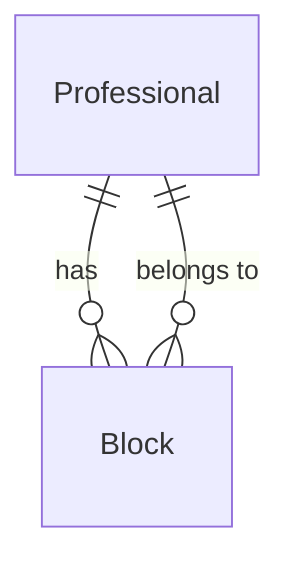

# MVP-3 — Bloqueios pontuais

## Problem

A grade do profissional é só a semana típica. Folga, feriado ou um intervalo fechado não existem como dado: o ponto continua na lista pública, na agenda do dia e nos `POST` de cliente e recepção. Quem marca paga com um horário que a recepção já sabia indisponível; a recepção paga apagando a faixa semanal ou recusando depois, na mão.

A evidência é o roadmap (revisão 2026-09-30): "A grade é só semanal. Não há folga, feriado nem bloqueio de um intervalo." e os testes nomeados — dia bloqueado sem slots, intervalo parcial só nos horários atingidos, bloqueio sobre agendamento ativo com 422. Não há volume de suporte nem prazo.

Com isto, a recepção registra um intervalo (ou o dia inteiro) com motivo. Esse intervalo some da grade e recusa nova marcação. Agendamento já ocupante permanece; o bloqueio que cair em cima dele não grava.

## Flow

A lista de horários e as escritas de booking continuam em `SlotOccupancy` (exists). O bloqueio entra na mesma omissão de ponto e na mesma recusa de intervalo; a trava da linha do profissional continua AD-001.

1. CRUD ` /admin/professionals/{professional}/blocks` entra em módulo de bloqueio admin (new, no door - placement per conventions) — persiste `Block` (door 1) ligado a `Professional` (exists).
2. `POST` e `PUT` de bloqueio, dentro de `SlotOccupancy::run` (exists), recusam se `[starts_at, ends_at)` cruzar booking ocupante e devolvem os `id` desses bookings; não apagam `Booking` (exists).
3. `SlotOccupancy::freeSlots` (exists) omite o ponto da grade cujo instante cai em algum `Block` daquele profissional. `GET /professionals/{id}/slots` e `GET /admin/agenda` (exists) leem essa lista.
4. `POST /bookings`, `POST /admin/bookings` e `PUT /admin/bookings/{booking}` que muda o intervalo (exists) recusam, na mesma transação, um intervalo que cruza `Block`.
5. out: JSON do bloqueio, array de slots sem os pontos atingidos, ou 422 com `{ message }` e, no conflito com ocupante, `booking_ids`.

## Impact

| Front | What changes |
| --- | --- |
| domain | new term: bloqueio — intervalo pontual `[starts_at, ends_at)` de um profissional, com motivo. Não é `Availability` (semana) nem `Booking`. Lives in the blocks CRUD and in `SlotOccupancy` |
| domain | existing term: horário livre passa a excluir também ponto ou intervalo que cruza um bloqueio. Quem ramifica hoje: `SlotOccupancy::freeSlots`, `BookingController::store`, `AdminBookingController::store`, `AdminBookingController::update`, `AdminBookingController::agenda` |
| stored data | tabela nova; nada a migrar nas linhas atuais. Bloqueio não reescreve `bookings` |

## Relations

One-way constraints: cada `Block` pertence a um `Professional` (door 1); o intervalo é meio-aberto `[starts_at, ends_at)` com `ends_at` estritamente depois de `starts_at` (door 1). No columns and no types here.

## Surface

| Route | In | Out | Status |
| --- | --- | --- | --- |
| `GET /admin/professionals/{professional}/blocks` | path `professional` | array de `{ id, professional_id, starts_at, ends_at, reason }` ordenado por `starts_at` crescente | `200`, `401`, `403`, `404` |
| `POST /admin/professionals/{professional}/blocks` | `starts_at`, `ends_at`, `reason` | o bloqueio criado | `201`, `401`, `403`, `404`, `422` |
| `PUT /admin/professionals/{professional}/blocks/{block}` | `starts_at`, `ends_at` e/ou `reason` | o bloqueio atualizado | `200`, `401`, `403`, `404`, `422` |
| `DELETE /admin/professionals/{professional}/blocks/{block}` | path | corpo vazio | `204`, `401`, `403`, `404` |

`GET /professionals/{id}/slots`, `GET /admin/agenda`, `POST /bookings`, `POST /admin/bookings` e `PUT /admin/bookings/{booking}` não mudam caminho nem chaves; passam a descontar `Block`.

## Landing

| One-way door | Literal shape | Alternative rejected |
| --- | --- | --- |
| Intervalo persistido | entidade `Block` com `starts_at` e `ends_at` em data-hora; dia inteiro é `[YYYY-MM-DD 00:00:00, dia seguinte 00:00:00)`; JSON de conflito `{ "message": "Intervalo com agendamento ativo.", "booking_ids": [<id>, ...] }` | linha extra em `availabilities` com um dia do calendário: a tabela hoje só expressa `day_of_week`, e um feriado misturado ali não distingue grade recorrente de exceção |
| Recusa com ocupante | o `POST`/`PUT` do bloqueio não apaga nem cancela `Booking`; se há ocupante no intervalo, 422 e os `id` | apagar ou cancelar o ocupante para “abrir” a folga: o roadmap exige histórico intacto e os ids de volta |

- A trava de escrita continua AD-001, agora também em volta da checagem de ocupante ao gravar o bloqueio. Nada mais nesta mudança é difícil de reverter.

## Criteria

### S1: A recepção grava e lista o bloqueio (P1)

CRUD admin no profissional, sem mexer em agendamento existente quando o intervalo está livre.

**Acceptance Criteria**

1. WHEN um admin envia `POST /admin/professionals/{id}/blocks` com `starts_at` `2026-10-05 12:00:00`, `ends_at` `2026-10-05 14:00:00` e `reason` `Folga` e não há ocupante nesse intervalo THEN the system SHALL responder 201 com `professional_id` igual a `{id}`, `reason` igual a `Folga`, e persistir o intervalo.
2. WHEN um admin pede `GET /admin/professionals/{id}/blocks` e existem dois bloqueios THEN the system SHALL responder 200 com os dois objetos ordenados por `starts_at` crescente.
3. WHEN um admin envia `PUT` no mesmo `{block}` com `reason` `Consulta médica` THEN the system SHALL responder 200 e persistir `reason` igual a `Consulta médica`.
4. WHEN um admin envia `DELETE` nesse `{block}` THEN the system SHALL responder 204 e SHALL não deixar essa linha em `blocks`.
5. IF `ends_at` não é estritamente depois de `starts_at` THEN `POST` e `PUT` SHALL responder 422 e SHALL não persistir o intervalo pedido.
6. IF `reason` vem vazio THEN `POST` SHALL responder 422 e SHALL não inserir linha.
7. IF `{professional}` não existe THEN the system SHALL responder 404.
8. IF `{block}` existe mas não pertence a esse `{professional}` THEN `PUT` e `DELETE` SHALL responder 404.
9. IF o pedido não traz token THEN cada uma das quatro rotas SHALL responder 401.
10. IF o chamador autenticado tem `is_admin` falso THEN cada uma das quatro rotas SHALL responder 403 e SHALL não inserir linha.

**Independent test:** CRUD em `/api/admin/professionals/{id}/blocks` com admin, com não-admin e sem token.

### S2: A grade esconde o intervalo bloqueado (P1)

Slots públicos e `free_slots` da agenda omitem o ponto atingido; o resto da janela permanece.

**Acceptance Criteria**

11. WHEN existe um `Block` `[2026-10-05 00:00:00, 2026-10-06 00:00:00)` nesse profissional e a grade da segunda emitiria `09:00`…`17:00` THEN `GET /professionals/{id}/slots?date=2026-10-05` SHALL responder 200 com array vazio.
12. WHEN o bloqueio é `[2026-10-05 12:00:00, 2026-10-05 14:00:00)` e a grade emite `11:00`, `12:00`, `13:00` e `14:00` THEN o array 200 SHALL incluir `11:00` e `14:00` e SHALL omitir `12:00` e `13:00`.
13. WHEN `GET /admin/agenda?date=2026-10-05` corre no mesmo caso do AC 12 THEN `free_slots` desse profissional SHALL omitir `12:00` e `13:00` e SHALL incluir `11:00` e `14:00`.
14. WHEN o único booking da data é `cancelado` às `12:00` e o bloqueio do AC 12 existe THEN the system SHALL ainda omitir `12:00` de `free_slots` (o bloqueio ocupa; o cancelado não).

**Independent test:** `GET /api/professionals/{id}/slots?date=2026-10-05` e `GET /api/admin/agenda?date=2026-10-05` com bloqueio de dia inteiro e com intervalo 12:00–14:00.

### S3: Marcação nova não entra no bloqueio (P1)

Cliente, recepção e reagendamento admin recusam o intervalo que cruza o bloqueio. Mudar só o status não passa por essa regra.

**Acceptance Criteria**

15. IF `[time, time + duration_minutes)` cruza um `Block` do mesmo profissional THEN `POST /bookings` SHALL responder 422 com JSON `message` igual a `Horário bloqueado.` e SHALL não inserir linha em `bookings`.
16. IF o mesmo cruzamento ocorre em `POST /admin/bookings` THEN the system SHALL responder 422 com `message` igual a `Horário bloqueado.` e SHALL não inserir linha.
17. IF `PUT /admin/bookings/{booking}` muda `professional_id`, `date` ou `time` para um intervalo que cruza um `Block` THEN the system SHALL responder 422 com `message` igual a `Horário bloqueado.` e SHALL manter `professional_id`, `date` e `time` anteriores.
18. WHEN o corpo do `PUT` muda apenas `status` e o booking atual cruza um `Block` THEN the system SHALL responder 200.
19. WHEN `POST /bookings` pede `09:00` com `duration_minutes` 120 e existe `Block` `[2026-10-05 10:00:00, 2026-10-05 11:00:00)` THEN the system SHALL responder 422 com `message` igual a `Horário bloqueado.`
20. WHEN o intervalo pedido não cruza bloqueio nem ocupante e cabe na janela THEN `POST /bookings` SHALL responder 201.

**Independent test:** `POST /api/bookings`, `POST /api/admin/bookings` e `PUT /api/admin/bookings/{id}` contra um bloqueio 10:00–11:00 e um serviço de 60 e de 120 minutos.

### S4: Bloqueio não apaga ocupante (P1)

Se o intervalo pedido cruza `pendente`, `confirmado` ou `concluído`, a API recusa e devolve esses ids.

**Acceptance Criteria**

21. IF `POST /admin/professionals/{id}/blocks` pede um intervalo que cruza um booking ocupante THEN the system SHALL responder 422 com `message` igual a `Intervalo com agendamento ativo.` e com `booking_ids` contendo exatamente os `id` desses ocupantes, e SHALL não inserir o bloqueio.
22. IF o único booking no intervalo é `cancelado` THEN `POST` SHALL responder 201 e persistir o bloqueio.
23. IF `PUT` desloca um bloqueio já gravado para cima de um ocupante THEN the system SHALL responder 422 com o mesmo `message` e `booking_ids`, e SHALL manter `starts_at` e `ends_at` anteriores.
24. The system SHALL not delete or change `status` of a `Booking` as a result of `POST`, `PUT` or `DELETE` on blocks.

**Independent test:** `POST` e `PUT` de bloqueio com um ocupante às 09:00 de 60 minutos e com um `cancelado` no mesmo `time`.

### S5: A aba Disponibilidades lista a folga (P2)

No profissional já escolhido na aba de disponibilidades, a recepção vê, cria, edita e apaga bloqueios.

**Acceptance Criteria**

25. WHEN a aba Disponibilidades tem um profissional selecionado THEN the system SHALL chamar `GET /admin/professionals/{id}/blocks` e SHALL mostrar cada `starts_at`, `ends_at` e `reason`.
26. WHEN essa lista chega vazia THEN the system SHALL mostrar o texto `Nenhum bloqueio cadastrado.`
27. WHILE o GET dos bloqueios não respondeu the system SHALL mostrar o texto `Carregando bloqueios...`
28. WHEN o GET dos bloqueios falha THEN the system SHALL mostrar o texto `Não foi possível carregar os bloqueios.`
29. WHEN a recepção envia o formulário de bloqueio THEN the system SHALL chamar `POST` ou `PUT` com `starts_at`, `ends_at` e `reason`.
30. WHEN esse POST ou PUT responde 422 THEN the system SHALL manter o formulário aberto e SHALL mostrar o `message` da resposta.
31. WHEN a recepção confirma a exclusão no `window.confirm` THEN the system SHALL chamar `DELETE /admin/professionals/{id}/blocks/{block}`.

**Independent test:** em `/admin`, aba Disponibilidades, profissional com zero bloqueios e com um bloqueio; criar com 201 e com 422 de ocupante; excluir.

## Out of scope

| Excluded | Why |
| --- | --- |
| Bloqueio único para todos os profissionais (feriado da casa) | o roadmap amarra o registro ao profissional |
| Recorrência semanal do bloqueio | isso já é `Availability`; o item é a exceção pontual |
| Desenhar o bloqueio na agenda do dia | o roadmap coloca lista e formulário na área de disponibilidades; a agenda só sente via `free_slots` |
| Antecedência de cancelamento e `estorno` (MVP-4) | cancelar não mexe no caixa neste item |
| Agenda autenticada do profissional (MVP-5) | o CRUD continua `admin` |
| Apagar ou cancelar ocupante para abrir folga | o histórico permanece; a API só recusa |

## Assumptions

| Assumption | Chosen default | Rationale | Confirmed? |
| --- | --- | --- | --- |
| Formato de `starts_at` / `ends_at` no corpo | `Y-m-d H:i:s` no fuso de `config/app.php` (hoje UTC) | o relógio do MVP-1 já é esse; não abrir outro fuso | n |
| Marcação do “dia inteiro” no formulário | a tela monta `[dia 00:00:00, dia seguinte 00:00:00)` e envia o mesmo par de campos | um flag `all_day` extra seria outra porta sem ganho de intervalo | n |
| Dois bloqueios que se cruzam | ambos persistem | o roadmap só recusa cruzamento com ocupante, não com outro bloqueio | n |
| Mensagem da marcação em cima do bloqueio | `Horário bloqueado.` distinta de `Horário já reservado.` | a recepção precisa ver que a recusa é folga, não outro cliente | n |
| Relógio na criação do bloqueio | aceitar intervalo no passado | o item é registrar a exceção, não uma janela futura obrigatória | n |

**Open questions:** none - all resolved or logged above.

## Observable

| Surface | Decision | Landing |
| --- | --- | --- |
| screen aba Disponibilidades, lista de bloqueios | empty state | AC 26 |
| screen aba Disponibilidades, lista de bloqueios | loading | AC 27 |
| screen aba Disponibilidades, lista de bloqueios | error state | AC 28 |
| screen aba Disponibilidades | unauthorized | existing - `PrivateRoute` `adminOnly` redireciona a `/`; a API responde 403 (AC 10) |
| screen aba Disponibilidades | density and ordering | AC 2, AC 25 — por `starts_at` crescente |
| screen aba Disponibilidades | destructive action confirms | AC 31 — `window.confirm`, como na exclusão de faixa semanal |
| screen formulário de bloqueio | error state | AC 30 |
| screen formulário de bloqueio | empty, loading | n/a - o submit só dispara depois do preenchimento; não há rascunho remoto |
| API `GET .../blocks` | error shape and codes | AC 7, AC 9, AC 10 |
| API `POST .../blocks` | error shape and codes | AC 5, AC 6, AC 21 |
| API `PUT .../blocks/{block}` | error shape and codes | AC 5, AC 8, AC 23 |
| API `DELETE .../blocks/{block}` | error shape and codes | AC 8, AC 9, AC 10 — 204 sem corpo |
| API all four block routes | who may call | AC 9, AC 10 — `auth:sanctum` + `admin` |
| API all four block routes | versioning, rate limits | n/a - prefixo `/api` não versiona; o grupo admin não ganha throttle novo |
| API `POST /bookings` e `POST /admin/bookings` | error shape and codes | AC 15, AC 16 — 422 `{ message: Horário bloqueado. }` |
| collection `blocks` no GET | grouping, naming, ordering, duplicates | AC 2 — um objeto por linha, ordem `starts_at`; duplicata de intervalo é permitida (assumption) |

## Sources

- `.specs/implementation-roadmap.md` seção MVP-3 — tabela de bloqueios, CRUD admin, slots e store descontam, 422 com ids se houver ocupante
- `AGENTS.md` — middleware `admin`, status ocupantes, slots só no servidor
- AD-001 em `.specs/STATE.md` — a checagem de ocupante ao gravar o bloqueio reusa `lockForUpdate` na linha do profissional
